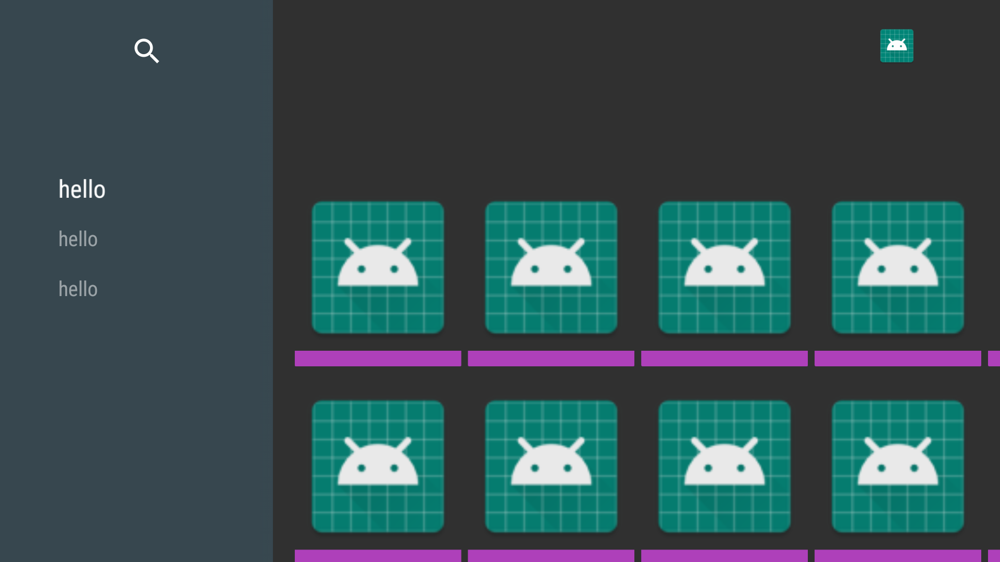
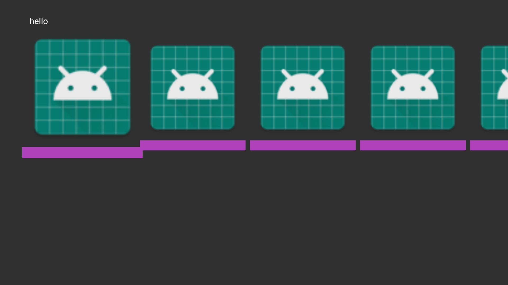
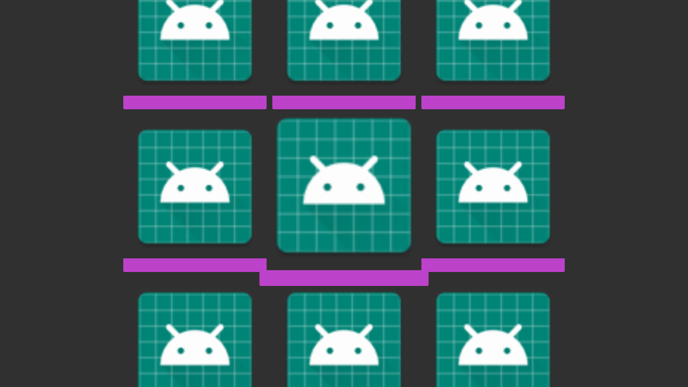
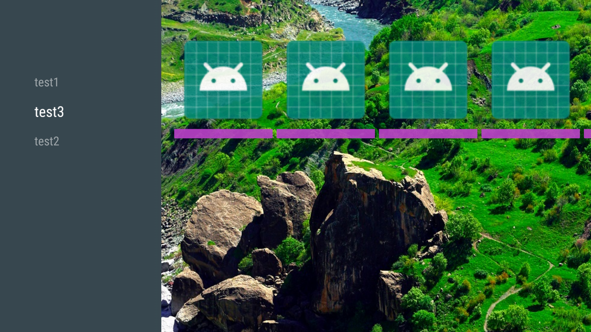
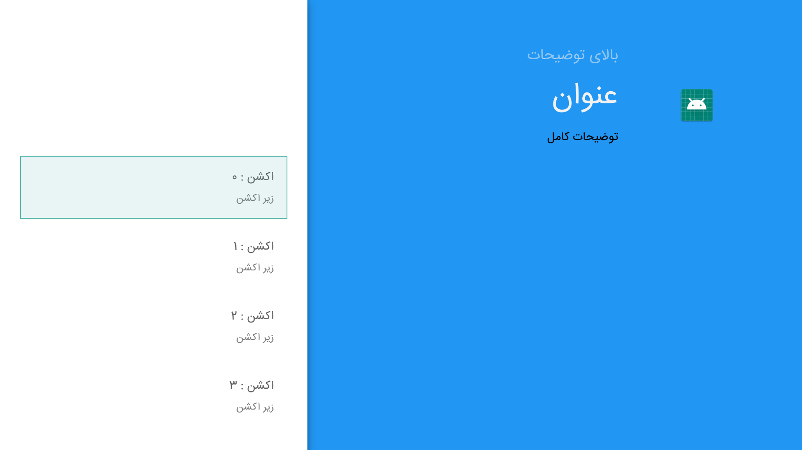
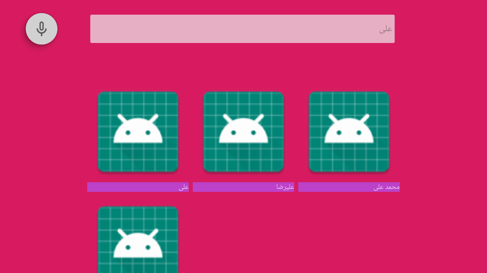

[](https://jitpack.io/#humatv/HumaLeanbackLibs)
# HumaLeanbackLibs
Use android tv leanback in easy way

<h1>Setup</h1>

```gradle
allProjects 
{	
	repositories {	
		// required to find the project's artifacts
		maven { url "https://www.jitpack.io" }
	}
}
```
```gradle
  dependencies {
    implementation 'com.github.humatv:HumaLeanbackLibs:1.2'
}
```

<h1>How to use it</h1>

first, You should create a item View to show in lists as below:<br/>
if You have model like a video class what you want to show of data like:
```
public class Video {
    public String name;
    public String imageUrl;
    public String videoUrl;

    public Video(String name) {
        this.name = name;
    }

    public Video() {
    }

    public static class MyVideoView extends MyBaseCardView<Video> { // this class convert video model to view

        public MyVideoView(Context context, int layoutResId) {
            super(context, layoutResId);
        }

        @Override
        public void fillData(Video video) { // this method call automatically for all of your items in list
            TextView textView = findViewById(R.id.Textview);
            textView.setText(video.name);
        }

        @Override
        protected void changeSelected(boolean selected, int pos) { // if selected item changed : this method call

        }


    }

}
```
and you must create layout.xml for items like this:
```
<?xml version="1.0" encoding="utf-8"?>
<LinearLayout xmlns:android="http://schemas.android.com/apk/res/android"
    android:layout_width="wrap_content"
    android:layout_height="wrap_content"
    android:orientation="vertical">

    <ImageView
        android:id="@+id/imageview"
        android:layout_width="200dp"
        android:layout_height="200dp"
        android:src="@mipmap/ic_launcher" />

    <TextView
        android:id="@+id/Textview"
        android:layout_width="match_parent"
        android:layout_height="wrap_content"
        android:background="#BC42C9"
        android:gravity="center_vertical"
        android:text="فیلم "
        />

</LinearLayout>
```

## 1) BaseBrowsFragment
[](https://raw.githubusercontent.com/googlesamples/androidtv-Leanback/master/images/screen1.png)

```
public class TestBaseBrowseFragment extends BaseBrowseFragment {
    ArrayObjectAdapter mRowsAdapter;


    @Override
    public void initial() {
        setShowHeader(true); // show navigation Menu

        // set fastLane (or headers) background color
	setBrandColor(ResourcesCompat.getColor(getResources(), R.color.fastlane_background, null));

        // set search icon color
	setSearchAffordanceColor(Color.TRANSPARENT);

        MyListRowPresenter p = new MyListRowPresenter(); // this presenter for vertical rows

	p.setRtl(true); // change rtl of page
	p.setShadowEnabled(true); 
        mRowsAdapter = new ArrayObjectAdapter(p); // this adapter for vertical rows


        BasePresenter<Video, Video.MyVideoView> cardPresenter = new BasePresenter<>(getActivity(), Video.MyVideoView.class, R.layout.item_video); // this presenter for horizontal rows

        ArrayObjectAdapter adapter1 = new ArrayObjectAdapter(cardPresenter); // this adapter for horizontal rows 
        for (int i = 0; i < 10; i++) {
            adapter1.add(new Video());
        }
        IconHeaderItem headerItem = new IconHeaderItem("Header");
	headerItem.setTypeface(...); // set typeface for headers

	// here we have 3 copy rows, you can create some more adapter and presenter
        mRowsAdapter.add(new ListRow(headerItem, adapter1));
        mRowsAdapter.add(new ListRow(headerItem, adapter1));
        mRowsAdapter.add(new ListRow(headerItem, adapter1));

        setAdapter(mRowsAdapter);

	// if you have title, you should create it in layout as xml file and use it here
        setTitleView(R.layout.custom_titleview, R.id.search_orb, new CustomTitleView.OnTitleReadyListener() {
            @Override
            public void onReady(View v) {
		// here you can find views and set datas
            }
        });

	
        setOnSearchClickedListener(new View.OnClickListener() {
            @Override
            public void onClick(View v) {
                Toast.makeText(getContext(), "hello", Toast.LENGTH_SHORT).show();
            }
        });
        
	setBackgroundUri("URL", false);
    }

    @Override
    public void onItemSelectedListener(View v, Object item, int rowPos, int pos) {
        Log.d("TestBaseBrowseFragment", "selected= " + rowPos + " : " + pos);
    }

    @Override
    public void onItemClickListener(View v, Object item, int rowPos, int pos) {

    }
}
```

## 2) RowsFragment
[](https://raw.githubusercontent.com/googlesamples/androidtv-Leanback/master/images/screen4.png)

if you want to show just some rows you can use it

```
public class TestBaseRowsFragment extends BaseRowsFragment {
    ArrayObjectAdapter mRowsAdapter;


    @Override
    public void initial() {

        MyListRowPresenter p = new MyListRowPresenter();
//        p.setHorizontalNumRows(3);
//        p.setRtl(true);
//        p.setShadowEnabled(true);
        mRowsAdapter = new ArrayObjectAdapter(p);
        setAlignment(100);

        BasePresenter<Video, Video.MyVideoView> cardPresenter = new BasePresenter<Video, Video.MyVideoView>(getActivity(), Video.MyVideoView.class, R.layout.item_video);
        ArrayObjectAdapter adapter1 = new ArrayObjectAdapter(cardPresenter);
        cardPresenter.setAdapter(adapter1);
        for (int i = 0; i < 10; i++) {
            adapter1.add(new Video());
        }
        IconHeaderItem headerItem = new IconHeaderItem("hello");
//        headerItem.setTypeface(FontManager.instance().getTypeface());
        mRowsAdapter.add(new ListRow(headerItem, adapter1));

        setAdapter(mRowsAdapter);

    }

    @Override
    public void onItemSelectedListener(View v, Object item, int rowPos, int pos) {
        Log.d("TestBaseBrowseFragment", "selected= " + rowPos + " : " + pos);
    }

    @Override
    public void onItemClickListener(View v, Object item, int rowPos, int pos) {

    }
}
```
## 3) GridFragment
[](https://raw.githubusercontent.com/googlesamples/androidtv-Leanback/master/images/screen3.png)

```
public class TestGridFragment extends BaseGridFragment {
    @Override
    public void onCreate(@Nullable Bundle savedInstanceState) {
        super.onCreate(savedInstanceState);

        VerticalGridPresenter presenter = new VerticalGridPresenter(FocusHighlight.ZOOM_FACTOR_LARGE, false);
        presenter.setShadowEnabled(false);
        presenter.setNumberOfColumns(3);
        setGridPresenter(presenter);

        BasePresenter<Video, Video.MyVideoView> cardPresenter = new BasePresenter<>(getActivity(), Video.MyVideoView.class, R.layout.item_video);


        ArrayObjectAdapter adapter1 = new ArrayObjectAdapter(cardPresenter);
        cardPresenter.setAdapter(adapter1);
        for (int i = 0; i < 10; i++) {
            adapter1.add(new Video());
        }
        setAdapter(adapter1);

    }

    @Override
    public void initial() {

    }

    @Override
    public void onItemSelectedListener(View v, Object item, int rowPos, int pos) {

    }

    @Override
    public void onItemClickListener(View v, Object item, int rowPos, int pos) {
    }
}
```

## 4) FragmentFactory
[](https://raw.githubusercontent.com/googlesamples/androidtv-Leanback/master/images/screen5.png)

```
public class TestFragmentFactory extends BaseBrowseFragment {
    ArrayObjectAdapter mRowsAdapter;

    @Override
    public void initial() {
        mRowsAdapter = new ArrayObjectAdapter(new MyListRowPresenter());

        PageRowFragmentFactory factory = new PageRowFragmentFactory(getActivity(), mRowsAdapter, this);
        factory.addFragment(1, new TestGridFragment());
        factory.addFragment(2, new TestGridFragment());
        factory.addFragment(3, new TestBaseRowsFragment());


        getMainFragmentRegistry().registerFragment(PageRow.class, factory);


        setAdapter(mRowsAdapter);
        createRows();
        startEntranceTransition();

        setBackgroundUri("URL", false);

    }


    private void createRows() {
        IconHeaderItem headerItem1 = new IconHeaderItem(1, "test1", null);
//        headerItem1.setTypeface(FontManager.instance().getTypeface());
        PageRow pageRow1 = new PageRow(headerItem1);
        mRowsAdapter.add(pageRow1);

        IconHeaderItem headerItem3 = new IconHeaderItem(3, "test3", null);
//        headerItem1.setTypeface(FontManager.instance().getTypeface());
        PageRow pageRow3 = new PageRow(headerItem3);
        mRowsAdapter.add(pageRow3);


        IconHeaderItem headerItem2 = new IconHeaderItem(2, "test2", null);
//        headerItem2.setTypeface(FontManager.instance().getTypeface());
        PageRow pageRow2 = new PageRow(headerItem2);
        mRowsAdapter.add(pageRow2);

    }

    @Override
    public void onItemSelectedListener(View v, Object item, int rowPos, int pos) {
        Toast.makeText(getContext(), "selected :" + pos, Toast.LENGTH_SHORT).show();
    }

    @Override
    public void onItemClickListener(View v, Object item, int rowPos, int pos) {

    }
}
```

##  5) GuidedStep
[](https://raw.githubusercontent.com/googlesamples/androidtv-Leanback/master/images/screen6.png)
```
public class TestFragmentFactory extends BaseBrowseFragment {
    ArrayObjectAdapter mRowsAdapter;

    @Override
    public void initial() {
        mRowsAdapter = new ArrayObjectAdapter(new MyListRowPresenter());

        PageRowFragmentFactory factory = new PageRowFragmentFactory(getActivity(), mRowsAdapter, this);
        factory.addFragment(1, new TestGridFragment());
        factory.addFragment(2, new TestGridFragment());
        factory.addFragment(3, new TestBaseRowsFragment());


        getMainFragmentRegistry().registerFragment(PageRow.class, factory);


        setAdapter(mRowsAdapter);
        createRows();
        startEntranceTransition();

        setBackgroundUri("URL", false);

    }


    private void createRows() {
        IconHeaderItem headerItem1 = new IconHeaderItem(1, "test1", null);
//        headerItem1.setTypeface(FontManager.instance().getTypeface());
        PageRow pageRow1 = new PageRow(headerItem1);
        mRowsAdapter.add(pageRow1);

        IconHeaderItem headerItem3 = new IconHeaderItem(3, "test3", null);
//        headerItem1.setTypeface(FontManager.instance().getTypeface());
        PageRow pageRow3 = new PageRow(headerItem3);
        mRowsAdapter.add(pageRow3);


        IconHeaderItem headerItem2 = new IconHeaderItem(2, "test2", null);
//        headerItem2.setTypeface(FontManager.instance().getTypeface());
        PageRow pageRow2 = new PageRow(headerItem2);
        mRowsAdapter.add(pageRow2);

    }

    @Override
    public void onItemSelectedListener(View v, Object item, int rowPos, int pos) {
        Toast.makeText(getContext(), "selected :" + pos, Toast.LENGTH_SHORT).show();
    }

    @Override
    public void onItemClickListener(View v, Object item, int rowPos, int pos) {

    }
}

```

## 6) SearchFragment

```
public class TestSearchFragment extends BaseSearchFragment {
    String[] str = {"علی", "علیرضا", "محمد علی", "جواد", "رضا", "حامد", "اضغر", "حمید", "محمد رضا", "علی اکبر", "اکبر"};
    ArrayObjectAdapter adapter1;

    @Override
    public void initial() {

        MyListRowPresenter p = new MyListRowPresenter();
        setAdapter(new ArrayObjectAdapter(p));
        setRtl();

        BasePresenter<Video, Video.MyVideoView> cardPresenter = new BasePresenter<>(getActivity(), Video.MyVideoView.class, R.layout.item_video);
        adapter1 = new ArrayObjectAdapter(cardPresenter);
        IconHeaderItem headerItem = new IconHeaderItem("نام ها");
        getAdapter().add(new ListRow(headerItem, adapter1));

        setTypeface(Typeface.createFromAsset(getActivity().getAssets(), "fonts/IRANSans.ttf"));

        startRecognition();

    }

    @Override
    public void onItemSelectedListener(View v, Object item, int rowPos, int pos) {

    }

    @Override
    public void onItemClickListener(View v, Object item, int rowPos, int pos) {

    }

    @Override
    public boolean onQueryTextChange(String newQuery) {

        return false;
    }

    @Override
    public boolean onQueryTextSubmit(String query) {
        adapter1.clear();
        for (int i = 0; i < str.length; i++) {
            if (str[i].indexOf(query) != -1)
                adapter1.add(new Video(str[i]));
        }

        return false;
    }
}

```

## 7)Detail Fragment
[](https://raw.githubusercontent.com/googlesamples/androidtv-Leanback/master/images/screen7.png)
```
public class TestDetailFragment extends BaseDetailFragment {
    @Override
    public void initial() {
        addAction(new Action(1, "hello"));
        setLogoDrawable(getResources().getDrawable(R.mipmap.ic_launcher));
        setBackgrouundDrawable(getResources().getDrawable(R.drawable.test));
        setBackgroundColor(Color.YELLOW);

        BasePresenter<Video, Video.MyVideoView> cardPresenter = new BasePresenter<>(getActivity(), Video.MyVideoView.class, R.layout.item_video);

        ArrayObjectAdapter adapter1 = new ArrayObjectAdapter(cardPresenter);
        for (int i = 0; i < 10; i++) {
            adapter1.add(new Video());
        }
        IconHeaderItem headerItem = new IconHeaderItem("hello");
//        headerItem.setTypeface(FontManager.instance().getTypeface());
        getAdapter().add(new ListRow(headerItem, adapter1));
        getAdapter().notifyItemRangeChanged(getAdapter().size()-1,1);
    }

    @Override
    public void onItemSelectedListener(View v, Object item, int rowPos, int pos) {

    }

    @Override
    public void onItemClickListener(View v, Object item, int rowPos, int pos) {
        Toast.makeText(getContext(), "click!", Toast.LENGTH_SHORT).show();
    }

    @Override
    public DetailsOverviewRow getDetailsOverview() {
        setDetailsView(R.layout.detail_view_content, new DetailsDescriptionPresenter.OnViewReady<Video>() {
            @Override
            public void onReady(View v, Video o) {

            }
        });
        return new DetailsOverviewRow(new Video("+18"));
    }


}

```

## 8) SearchGridFragment
[](https://raw.githubusercontent.com/googlesamples/androidtv-Leanback/master/images/screen8.png)
```
public class TestSearchGridFragment extends BaseSearchGridFragment {
    String[] str = {"علی", "علیرضا", "محمد علی", "جواد", "رضا", "حامد", "اضغر", "حمید", "محمد رضا", "علی اکبر", "اکبر"};
    ArrayObjectAdapter adapter1;
    @Override
    public void initial() {
//        setmRowsSupportFragment(new TestGridFragment());

        VerticalGridPresenter presenter = new VerticalGridPresenter(FocusHighlight.ZOOM_FACTOR_LARGE, false);
        presenter.setShadowEnabled(false);
        presenter.setNumberOfColumns(3);
        setGridPresenter(presenter);

        BasePresenter<Video, Video.MyVideoView> cardPresenter = new BasePresenter<>(getActivity(), Video.MyVideoView.class, R.layout.item_video);


        adapter1 = new ArrayObjectAdapter(cardPresenter);
        cardPresenter.setAdapter(adapter1);
//        for (int i = 0; i < 10; i++) {
//            adapter1.add(new Video());
//        }
        setAdapter(adapter1);
        startRecognition();


        setBackgroundDrawable(getResources().getDrawable(R.color.colorAccent),false);

    }

    @Override
    public void onItemSelectedListener(View v, Object item, int rowPos, int pos) {

    }

    @Override
    public void onItemClickListener(View v, Object item, int rowPos, int pos) {

    }

    @Override
    public boolean onQueryTextChange(String newQuery) {
        Toast.makeText(getActivity(), "change : "+newQuery, Toast.LENGTH_SHORT).show();
        return false;
    }

    @Override
    public boolean onQueryTextSubmit(String query) {
        Toast.makeText(getActivity(), "sumbit : "+query, Toast.LENGTH_SHORT).show();

        adapter1.clear();
        for (int i = 0; i < str.length; i++) {
            if (str[i].indexOf(query) != -1)
                adapter1.add(new Video(str[i]));
        }

        return false;
    }
}

```

## Use Fragments in Activities:
First way :Adding Activity
```
<?xml version="1.0" encoding="utf-8"?>
<FrameLayout xmlns:android="http://schemas.android.com/apk/res/android"
    xmlns:app="http://schemas.android.com/apk/res-auto"
    xmlns:tools="http://schemas.android.com/tools"
    android:layout_width="match_parent"
    android:layout_height="match_parent"
    android:id="@+id/frameLayout"
    tools:context=".MainActivity"/>

```
```
public class MainActivity extends FragmentActivity {

    @Override
    protected void onCreate(Bundle savedInstanceState) {
        super.onCreate(savedInstanceState);
        setContentView(R.layout.activity_main);


        FragmentTransaction tx = getSupportFragmentManager().beginTransaction();
        TestFragment t = new TestFragment();
        t.setArguments(getIntent().getExtras());
        tx.replace(R.id.frameLayout, t, "mainFragment");
        tx.commit();
    }
}
```
Or Second way with Huma Lib:
```
Bundle b= new Bundle();
b.putString("key","value");
boolean isRtl = true;
HumaUtil.startFragment(context, TestGuidedStepFragment.class, b, isRtl);
```
